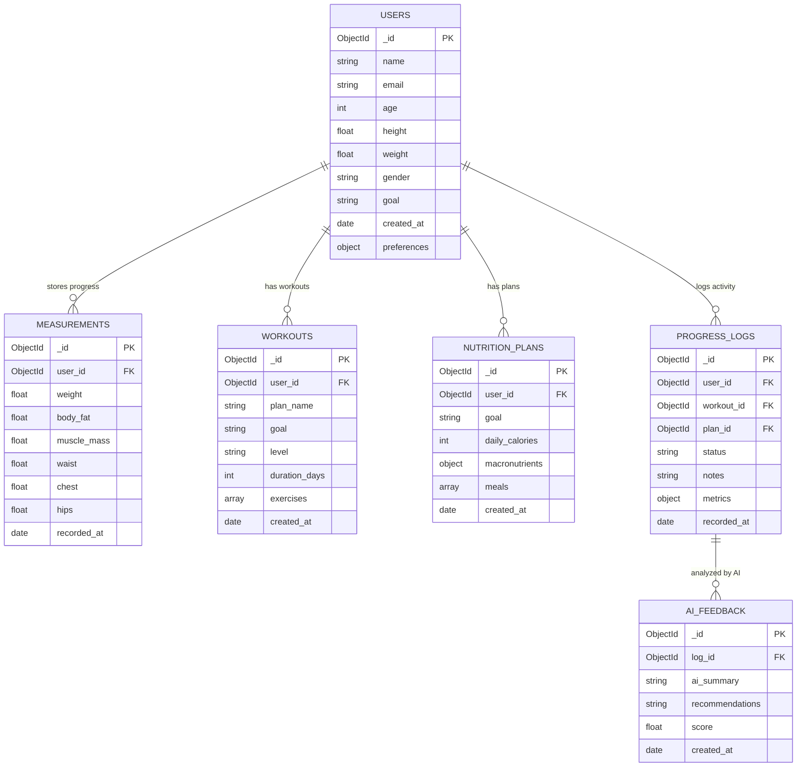

```mermaid
erDiagram
    USERS {
        ObjectId _id PK
        string name
        string email
        int age
        float height
        float weight
        string gender
        string goal
        date created_at
        object preferences
    }

    MEASUREMENTS {
        ObjectId _id PK
        ObjectId user_id FK
        float weight
        float body_fat
        float muscle_mass
        float waist
        float chest
        float hips
        date recorded_at
    }

    WORKOUTS {
        ObjectId _id PK
        ObjectId user_id FK
        string plan_name
        string goal
        string level
        int duration_days
        array exercises
        date created_at
    }

    NUTRITION_PLANS {
        ObjectId _id PK
        ObjectId user_id FK
        string goal
        int daily_calories
        object macronutrients
        array meals
        date created_at
    }

    PROGRESS_LOGS {
        ObjectId _id PK
        ObjectId user_id FK
        ObjectId workout_id FK
        ObjectId plan_id FK
        string status
        string notes
        object metrics
        date recorded_at
    }

    AI_FEEDBACK {
        ObjectId _id PK
        ObjectId log_id FK
        string ai_summary
        string recommendations
        float score
        date created_at
    }

    USERS ||--o{ MEASUREMENTS : "stores progress"
    USERS ||--o{ WORKOUTS : "has workouts"
    USERS ||--o{ NUTRITION_PLANS : "has plans"
    USERS ||--o{ PROGRESS_LOGS : "logs activity"
    PROGRESS_LOGS ||--o{ AI_FEEDBACK : "analyzed by AI"
```