# Diagrama Entidad-Relación (ER) - MongoDB

Este documento describe las colecciones de MongoDB identificadas en el aplicativo y sus relaciones clave.

```mermaid
erDiagram
    USERS ||--|| USER_PROFILES : "1:1 (Detalles físicos)"
    USERS ||--|| USER_ROLES : "1:1 (Permisos)"
    USERS ||--|| USER_STATUS : "1:1 (Estado)"
    USERS ||--|{ ONBOARDING_SUBMISSIONS : "1:N (Historial)"
    USERS ||--|{ BODY_ASSESSMENTS : "1:N (Progreso físico)"
    USERS ||--|{ ROUTINES : "1:N (Rutinas asignadas/creadas)"
    USERS ||--|{ MEAL_PLAN : "1:N (Planes nutricionales)"
    USERS ||--|{ PROGRESS : "1:N (Bitácora de peso/medidas)"
    USERS ||--|{ NOTIFICATIONS : "1:N (Alertas)"
    USERS ||--|{ PLANS : "1:N (Suscripciones/Planes)"
    USERS ||--|{ AI_ROUTINES : "1:N (Generadas por AI)"

    USERS {
        ObjectId _id
        string user_id "Identificador único (UUID/String)"
        string username
        string email
        string password_hash
        string name
        string profile_image_url
        boolean onboarding_completed
        datetime created_at
    }

    USER_PROFILES {
        ObjectId _id
        string user_id "FK"
        number age
        number weight
        number height
        string gender
        string fitness_level
    }

    USER_ROLES {
        ObjectId _id
        string user_id "FK"
        string role "admin | user | trainer"
    }

    ONBOARDING_SUBMISSIONS {
        ObjectId _id
        string user_id "FK"
        object data "Respuestas del Wizard (JSON)"
        datetime submission_date
    }

    BODY_ASSESSMENTS {
        ObjectId _id
        string user_id "FK"
        object metrics "Grasa, Músculo, etc."
        array photos_urls
        datetime date
    }

    ROUTINES {
        ObjectId _id
        string user_id "FK (Owner)"
        string name
        string description
        array exercises "Lista de ejercicios y series"
        boolean active
        datetime created_at
    }

    EXERCISES {
        ObjectId _id
        string name
        string muscle_group
        string equipment
        string type
        string video_url
        object instructions
    }

    MEAL_PLAN {
        ObjectId _id
        string user_id "FK"
        array meals
        number target_calories
        boolean active
        datetime created_at
    }

    NOTIFICATIONS {
        ObjectId _id
        string user_id "FK"
        string message
        string type
        boolean read
        datetime created_at
    }

    AI_ROUTINES {
        ObjectId _id
        string user_id "FK"
        object routine_data "Estructura generada"
        datetime created_at
    }

    DEMO_ROUTINES {
        ObjectId _id
        object routine_data "Plantillas base"
        string difficulty
        string goal
    }

    PLANS {
        ObjectId _id
        string user_id "FK"
        string type "free | premium"
        boolean active
        datetime start_date
        datetime end_date
    }

    PROGRESS {
        ObjectId _id
        string user_id "FK"
        number weight
        object measurements
        datetime date
    }
```

## Descripción de Colecciones

| Colección | Descripción |
| :--- | :--- |
| **users** | Almacena la información de autenticación y datos básicos del usuario. |
| **user_profiles** | Contiene datos antropométricos y detalles del perfil físico. |
| **user_roles** | Define el rol y permisos del usuario en la plataforma. |
| **onboarding_submissions** | Historial completo de respuestas del cuestionario de inicio (Wizard). |
| **body_assessments** | Registros de evaluaciones físicas, incluyendo métricas y fotos de progreso. |
| **routines** | Rutinas de entrenamiento personalizadas o asignadas a los usuarios. |
| **exercises** | Catálogo maestro de ejercicios disponibles en la plataforma. |
| **meal_plans** | Planes de alimentación asignados a los usuarios. |
| **notifications** | Sistema de alertas y mensajes para el usuario. |
| **ai_routines** | Rutinas generadas específicamente por el motor de IA. |
| **demo_routines** | Plantillas de rutinas utilizadas para demostraciones o clonación. |
| **plans** | Gestión de suscripciones o planes de entrenamiento activos. |
| **progress** | Bitácora diaria/semanal de peso y medidas corporales. |